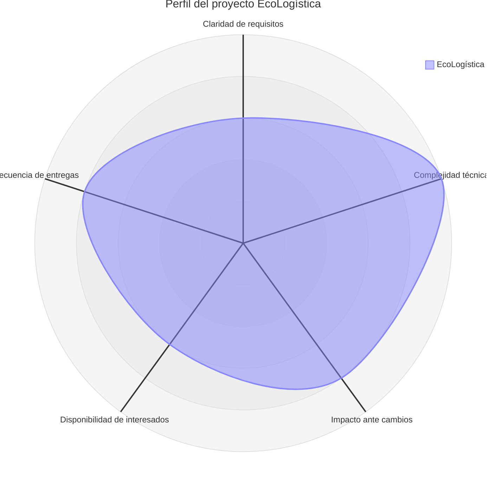

# 01. Selección del enfoque del proyecto

[← Volver al README Principal](../../README.md)

## 1. Metadatos

| Campo | Información |
|---|---|
| Nombre del proyecto | EcoLogística – Sistema de Optimización de Rutas Sostenibles |
| Integrantes | POMACHAGUA YAPIAS BRYAN ANTONY, CAJAMALQUI DAVILA JOSEMARIA PIERO |
| Director del Proyecto | ZEVALLOS MELENDRES YIMER EDYSON |
| Fecha | 01/10/2026 |
| Versión | 1.1.0 |

## 2. Marco teórico

La elección del enfoque se sustenta en el *tailoring* de la Guía PMBOK, 7.ª edición: el enfoque de desarrollo no es único y se adapta según la incertidumbre de los requisitos, la complejidad, el riesgo y la cadencia con la que debe entregarse valor (Project Management Institute, 2021). PMBOK 7 distingue tres enfoques:

| Enfoque | Cuándo corresponde | Límite para EcoLogística |
|---|---|---|
| Predictivo | El alcance se puede definir al inicio y el cambio es costoso. | Sirve para ámbito geográfico, presupuesto, gobernanza y línea base de requisitos. |
| Ágil | Los requisitos evolucionan y el valor se valida en incrementos cortos. | Sirve para el algoritmo, la interfaz y la reoptimización, que solo se confirman al probarlos. |
| Híbrido | Una parte del trabajo es estable y otra es incierta. | Es el caso de este proyecto: hay restricciones fijas y, a la vez, experimentación técnica. |

Se complementa con el marco Cynefin (Snowden y Boone, 2007). El presupuesto, el calendario académico y el límite El Tambo–Huancayo–Chilca están en el dominio complicado: se analizan y se planifican. El algoritmo de rutas, con capacidad, ventanas de tiempo y emisiones, está en el dominio complejo: el resultado se conoce al experimentar. Forzar un solo enfoque dejaría sin control la línea base o sin aprendizaje el algoritmo.

## 3. Matriz de ponderación

Escala de 1 (muy bajo) a 5 (muy alto).

| Variable | Puntaje | Justificación |
|---|---:|---|
| Claridad y estabilidad de requisitos | 3 | El problema y el ámbito están definidos; los parámetros del algoritmo aún se validan por iteración. |
| Complejidad técnica e innovación | 5 | Integra optimización, restricciones operativas, georreferenciación WGS84 y estimación de CO₂. |
| Severidad del impacto ante cambios | 4 | Un cambio de criterio de optimización afecta datos, algoritmo, API e interfaz. |
| Disponibilidad de los interesados | 3 | Operaciones, contratante y docente participan según su interés; su tiempo no es continuo. |
| Frecuencia de entregas de valor | 4 | El producto se puede demostrar por incrementos: registros, rutas, mapa e indicadores. |

Promedio: (3 + 5 + 4 + 3 + 4) / 5 = **3.8**. Un valor intermedio, con un pico de complejidad, descarta el enfoque solo predictivo y el enfoque solo ágil.

## 4. Diagrama de radar

| Eje | Valor | Lectura en el radar |
|---|---:|---|
| Claridad de requisitos | 3 | Centro del gráfico: hace falta una línea base, no un alcance cerrado al detalle. |
| Complejidad técnica | 5 | Vértice exterior: empuja el trabajo del algoritmo hacia ciclos cortos. |
| Impacto ante cambios | 4 | Vértice alto: el cambio se controla, no se improvisa. |
| Disponibilidad de interesados | 3 | Centro: la validación se agenda; no se asume presencia diaria. |
| Frecuencia de entregas | 4 | Vértice alto: hay valor demostrable cada sprint. |

## 5. Decisión

**Enfoque seleccionado: híbrido.**

La porción predictiva fija, al inicio, el acta, el ámbito geográfico, la geolocalización por coordenadas WGS84, el presupuesto y la arquitectura de referencia. La porción ágil, con Scrum en sprints de dos semanas, construye y valida el algoritmo, el mapa y los indicadores. Esta división coincide con PMBOK 7: se planifica lo que ya se puede definir y se adapta lo que solo la evidencia técnica puede confirmar.

## 6. Control de cambios

| Versión | Fecha | Descripción | Responsable |
|---|---|---|---|
| 1.0.0 | 27/08/2026 | Versión inicial. | ZEVALLOS MELENDRES YIMER EDYSON |
| 1.1.0 | 01/10/2026 | Se incorporó el marco PMBOK 7 y Cynefin, y el diagrama de radar. Se sintetizó el análisis repetido de variables. | ZEVALLOS MELENDRES YIMER EDYSON |
