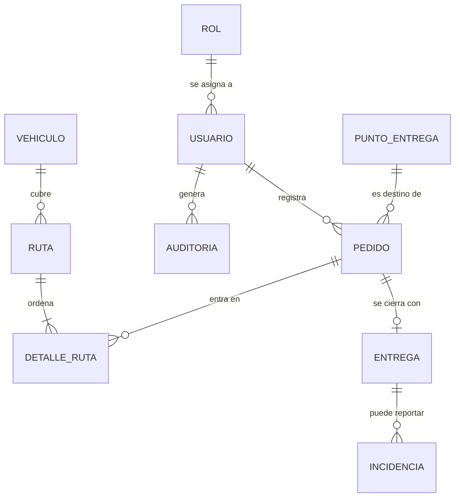

# 11. Base de datos

[← Volver al README Principal](../../README.md)

| Campo | Información |
|---|---|
| Proyecto | EcoLogística |
| Motor | PostgreSQL |
| Normalización | Tercera forma normal |
| Versión | 1.1.0 |
| Fecha | 2026-10-01 |

La geolocalización del punto de entrega es un par latitud/longitud WGS84. No hay posición GPS del vehículo.

## 1. Modelo conceptual

Diagrama entidad-relación. Solo entidades y relaciones. Las claves están en el modelo lógico.



| Relación | Cardinalidad | Significado |
|---|---|---|
| Rol–Usuario | Uno a muchos | Un rol lo tienen varios usuarios. |
| Usuario–Pedido | Uno a muchos | Un usuario registra varios pedidos. |
| Vehículo–Ruta | Uno a muchos | Un vehículo cubre varias rutas en el tiempo. |
| Ruta–Detalle | Uno a muchos | Una ruta tiene al menos una parada. |
| Pedido–Detalle | Uno a muchos | Un pedido no debe quedar en dos rutas activas; la regla se controla en el negocio. |
| Punto–Pedido | Uno a muchos | Varios pedidos pueden compartir destino. |
| Pedido–Entrega | Uno a uno | Cada pedido se cierra con una entrega. |
| Entrega–Incidencia | Uno a muchos | Una entrega fallida puede tener incidencias. |

## 2. Modelo lógico

Tercera forma normal. **PK** clave primaria, **AK** clave alterna, **FK** clave foránea.

### Rol

| Atributo | Tipo | Clave | Nulo |
|---|---|---|---|
| rol_id | UUID | PK | No |
| nombre | VARCHAR(50) | AK | No |
| descripcion | TEXT | — | Sí |

### Usuario

| Atributo | Tipo | Clave | Nulo |
|---|---|---|---|
| usuario_id | UUID | PK | No |
| rol_id | UUID | FK → Rol | No |
| nombre | VARCHAR(150) | — | No |
| email | VARCHAR(255) | AK | No |
| password_hash | VARCHAR(255) | — | No |
| intentos_fallidos | INTEGER | — | No |
| bloqueado_hasta | TIMESTAMPTZ | — | Sí |
| estado | VARCHAR(20) | — | No |
| creado_en | TIMESTAMPTZ | — | No |

### Vehículo

| Atributo | Tipo | Clave | Nulo |
|---|---|---|---|
| vehiculo_id | UUID | PK | No |
| placa | VARCHAR(20) | AK | No |
| capacidad_kg | NUMERIC(10,2) | — | No |
| estado | VARCHAR(20) | — | No |

### Punto de entrega

| Atributo | Tipo | Clave | Nulo |
|---|---|---|---|
| punto_id | UUID | PK | No |
| nombre | VARCHAR(150) | — | No |
| direccion | TEXT | — | No |
| latitud | NUMERIC(9,6) | — | No |
| longitud | NUMERIC(9,6) | — | No |
| distrito | VARCHAR(100) | — | No |
| metodo_geolocalizacion | VARCHAR(30) | — | No |

`metodo_geolocalizacion` solo admite `WGS84`. Latitud y longitud son el resultado de georreferenciar la dirección.

### Pedido

| Atributo | Tipo | Clave | Nulo |
|---|---|---|---|
| pedido_id | UUID | PK | No |
| punto_id | UUID | FK → Punto de entrega | No |
| usuario_id | UUID | FK → Usuario | No |
| peso_kg | NUMERIC(10,2) | — | No |
| tipo_carga | VARCHAR(30) | — | No |
| estado | VARCHAR(30) | — | No |
| fecha_registro | TIMESTAMPTZ | — | No |

`tipo_carga` solo admite `GENERAL`. La carga peligrosa o prohibida se rechaza y no se persiste (RN-016).

### Ruta

| Atributo | Tipo | Clave | Nulo |
|---|---|---|---|
| ruta_id | UUID | PK | No |
| vehiculo_id | UUID | FK → Vehículo | No |
| estado | VARCHAR(30) | — | No |
| distancia_km | NUMERIC(12,2) | — | Sí |
| tiempo_min | NUMERIC(12,2) | — | Sí |
| creado_en | TIMESTAMPTZ | — | No |

### Detalle de ruta

| Atributo | Tipo | Clave | Nulo |
|---|---|---|---|
| detalle_id | UUID | PK | No |
| ruta_id | UUID | FK → Ruta | No |
| pedido_id | UUID | FK → Pedido | No |
| orden_visita | INTEGER | AK compuesta con ruta_id | No |

La pareja (`ruta_id`, `pedido_id`) también es clave alterna: un pedido entra una sola vez en la misma ruta.

### Entrega

| Atributo | Tipo | Clave | Nulo |
|---|---|---|---|
| entrega_id | UUID | PK | No |
| pedido_id | UUID | AK, FK → Pedido | No |
| estado | VARCHAR(30) | — | No |
| fecha_entrega | TIMESTAMPTZ | — | Sí |

### Incidencia

| Atributo | Tipo | Clave | Nulo |
|---|---|---|---|
| incidencia_id | UUID | PK | No |
| entrega_id | UUID | FK → Entrega | No |
| descripcion | TEXT | — | No |
| registrado_en | TIMESTAMPTZ | — | No |

### Auditoría

| Atributo | Tipo | Clave | Nulo |
|---|---|---|---|
| auditoria_id | UUID | PK | No |
| usuario_id | UUID | FK → Usuario | Sí |
| accion | VARCHAR(100) | — | No |
| entidad | VARCHAR(100) | — | No |
| entidad_id | UUID | — | Sí |
| creado_en | TIMESTAMPTZ | — | No |

Dependencias: todo atributo no clave depende de la PK de su entidad y no de otro atributo no clave. Distrito no determina la coordenada por sí solo; ambos describen el punto. Por eso el modelo está en 3FN.

## 3. Modelo físico

```sql
CREATE EXTENSION IF NOT EXISTS pgcrypto;

CREATE TABLE roles (
    rol_id UUID PRIMARY KEY DEFAULT gen_random_uuid(),
    nombre VARCHAR(50) NOT NULL UNIQUE,
    descripcion TEXT
);

CREATE TABLE usuarios (
    usuario_id UUID PRIMARY KEY DEFAULT gen_random_uuid(),
    rol_id UUID NOT NULL REFERENCES roles (rol_id),
    nombre VARCHAR(150) NOT NULL,
    email VARCHAR(255) NOT NULL UNIQUE,
    password_hash VARCHAR(255) NOT NULL,
    intentos_fallidos INTEGER NOT NULL DEFAULT 0,
    bloqueado_hasta TIMESTAMPTZ,
    estado VARCHAR(20) NOT NULL DEFAULT 'ACTIVO',
    creado_en TIMESTAMPTZ NOT NULL DEFAULT CURRENT_TIMESTAMP
);

CREATE TABLE vehiculos (
    vehiculo_id UUID PRIMARY KEY DEFAULT gen_random_uuid(),
    placa VARCHAR(20) NOT NULL UNIQUE,
    capacidad_kg NUMERIC(10,2) NOT NULL CHECK (capacidad_kg > 0),
    estado VARCHAR(20) NOT NULL DEFAULT 'DISPONIBLE'
);

CREATE TABLE puntos_entrega (
    punto_id UUID PRIMARY KEY DEFAULT gen_random_uuid(),
    nombre VARCHAR(150) NOT NULL,
    direccion TEXT NOT NULL,
    latitud NUMERIC(9,6) NOT NULL,
    longitud NUMERIC(9,6) NOT NULL,
    distrito VARCHAR(100) NOT NULL CHECK (distrito IN ('El Tambo', 'Huancayo', 'Chilca')),
    metodo_geolocalizacion VARCHAR(30) NOT NULL DEFAULT 'WGS84'
        CHECK (metodo_geolocalizacion = 'WGS84')
);

CREATE TABLE pedidos (
    pedido_id UUID PRIMARY KEY DEFAULT gen_random_uuid(),
    punto_id UUID NOT NULL REFERENCES puntos_entrega (punto_id),
    usuario_id UUID NOT NULL REFERENCES usuarios (usuario_id),
    peso_kg NUMERIC(10,2) NOT NULL CHECK (peso_kg > 0),
    tipo_carga VARCHAR(30) NOT NULL DEFAULT 'GENERAL' CHECK (tipo_carga = 'GENERAL'),
    estado VARCHAR(30) NOT NULL DEFAULT 'PENDIENTE',
    fecha_registro TIMESTAMPTZ NOT NULL DEFAULT CURRENT_TIMESTAMP
);

CREATE TABLE rutas (
    ruta_id UUID PRIMARY KEY DEFAULT gen_random_uuid(),
    vehiculo_id UUID NOT NULL REFERENCES vehiculos (vehiculo_id),
    estado VARCHAR(30) NOT NULL DEFAULT 'PROPUESTA',
    distancia_km NUMERIC(12,2),
    tiempo_min NUMERIC(12,2),
    creado_en TIMESTAMPTZ NOT NULL DEFAULT CURRENT_TIMESTAMP
);

CREATE TABLE detalle_ruta (
    detalle_id UUID PRIMARY KEY DEFAULT gen_random_uuid(),
    ruta_id UUID NOT NULL REFERENCES rutas (ruta_id),
    pedido_id UUID NOT NULL REFERENCES pedidos (pedido_id),
    orden_visita INTEGER NOT NULL CHECK (orden_visita > 0),
    UNIQUE (ruta_id, pedido_id),
    UNIQUE (ruta_id, orden_visita)
);

CREATE TABLE entregas (
    entrega_id UUID PRIMARY KEY DEFAULT gen_random_uuid(),
    pedido_id UUID NOT NULL UNIQUE REFERENCES pedidos (pedido_id),
    estado VARCHAR(30) NOT NULL,
    fecha_entrega TIMESTAMPTZ
);

CREATE TABLE incidencias (
    incidencia_id UUID PRIMARY KEY DEFAULT gen_random_uuid(),
    entrega_id UUID NOT NULL REFERENCES entregas (entrega_id),
    descripcion TEXT NOT NULL,
    registrado_en TIMESTAMPTZ NOT NULL DEFAULT CURRENT_TIMESTAMP
);

CREATE TABLE auditoria (
    auditoria_id UUID PRIMARY KEY DEFAULT gen_random_uuid(),
    usuario_id UUID REFERENCES usuarios (usuario_id),
    accion VARCHAR(100) NOT NULL,
    entidad VARCHAR(100) NOT NULL,
    entidad_id UUID,
    creado_en TIMESTAMPTZ NOT NULL DEFAULT CURRENT_TIMESTAMP
);

CREATE INDEX idx_usuarios_email ON usuarios (email);
CREATE INDEX idx_pedidos_estado ON pedidos (estado);
CREATE INDEX idx_puntos_distrito ON puntos_entrega (distrito);
```

## 4. Control de cambios

| Versión | Fecha | Descripción | Responsable |
|---|---|---|---|
| 1.0.0 | 2026-09-03 | Versión inicial. El diagrama conceptual incluía claves. | Equipo EcoLogística |
| 1.1.0 | 2026-10-01 | El conceptual quedó como entidad-relación. El lógico declara PK, AK y FK, e incorpora WGS84 y tipo de carga. | ZEVALLOS MELENDRES YIMER EDYSON |
