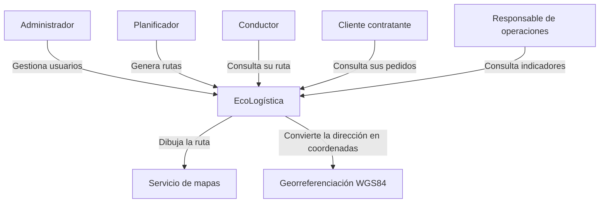
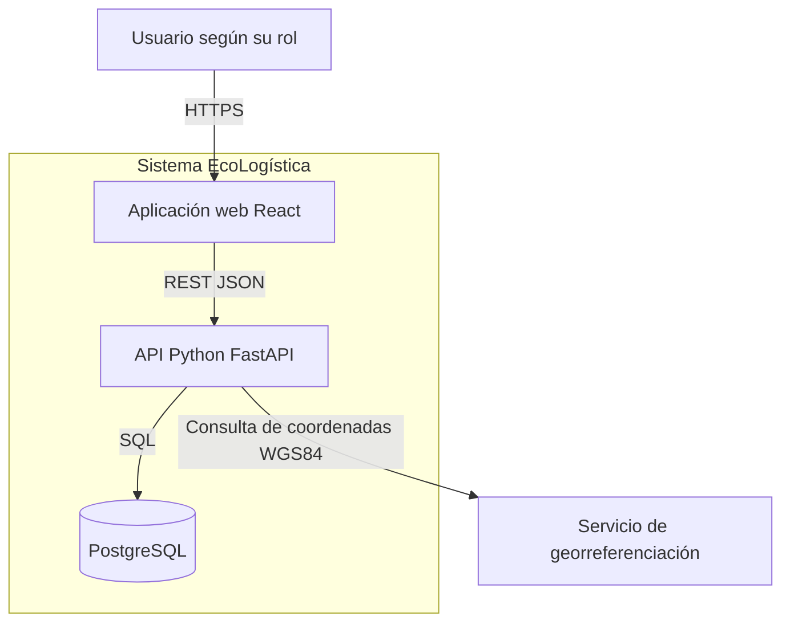
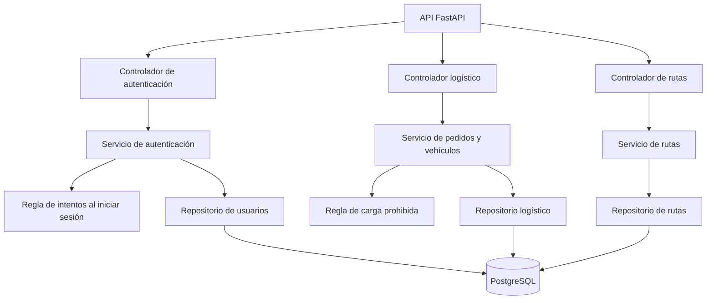
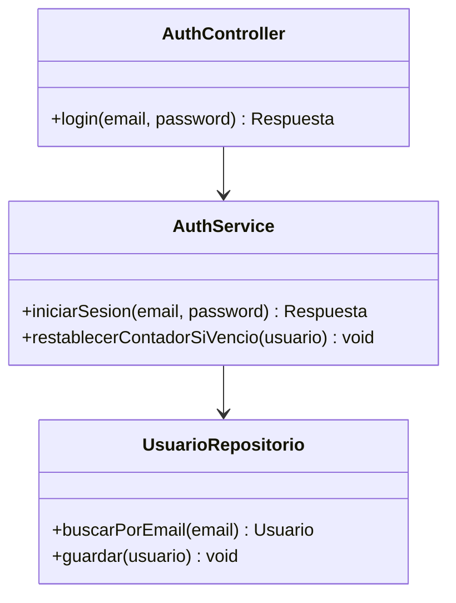

# 12. Modelo C4

[← Volver al README Principal](../../README.md)

| Campo | Información |
|---|---|
| Proyecto | EcoLogística |
| Versión | 1.1.0 |
| Fecha | 2026-10-01 |

El modelo C4 de este documento tiene cuatro niveles: contexto, contenedores, componentes y código. El nivel de código que faltaba describe el inicio de sesión.

## 1. Nivel 1. Contexto

## 2. Nivel 2. Contenedores

Solo contenedores ejecutables. Los módulos internos van en el nivel 3.

| Contenedor | Responsabilidad |
|---|---|
| Aplicación web | Formularios, mapa e indicadores. |
| API | Reglas de negocio, acceso y persistencia. |
| PostgreSQL | Datos normalizados del modelo lógico. |
| Georreferenciación | Dirección a latitud y longitud. Es externo al sistema. |

## 3. Nivel 3. Componentes de la API

## 4. Nivel 4. Código del inicio de sesión

Este es el modelo que completa el C4. Muestra cómo el contador se evalúa al comenzar el inicio de sesión, antes de aceptar o rechazar la credencial.

Orden dentro de `iniciarSesion`:

1. Buscar al usuario.
2. Al comenzar, si el bloqueo venció, restablecer el contador.
3. Si el bloqueo sigue vigente, rechazar sin abrir sesión.
4. Validar la credencial.
5. Si es válida, conceder el acceso. Si no, incrementar el contador y bloquear al tercer fallo.

## 5. Control de cambios

| Versión | Fecha | Descripción | Responsable |
|---|---|---|---|
| 1.0.0 | 2026-09-03 | Contexto, contenedores y componentes. | Equipo EcoLogística |
| 1.1.0 | 2026-10-01 | Se separaron los contenedores de los componentes y se agregó el modelo de código del inicio de sesión. | ZEVALLOS MELENDRES YIMER EDYSON |
